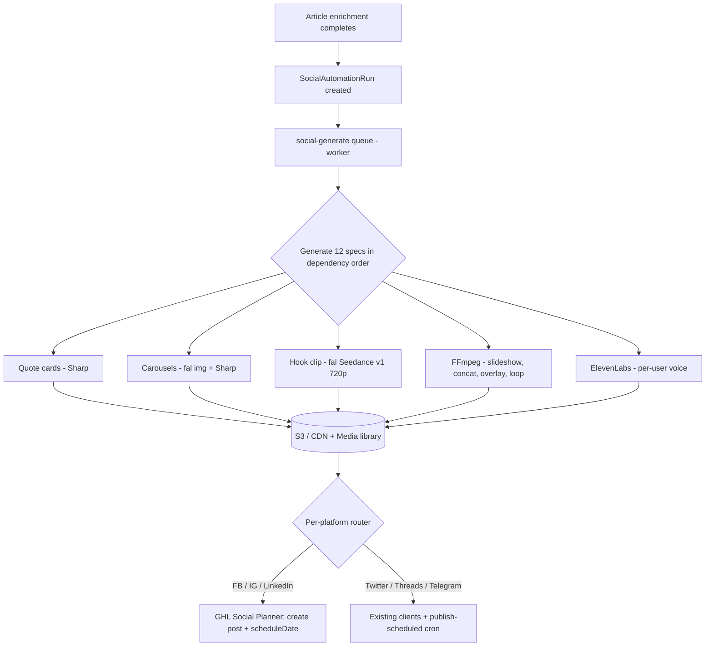

# Social Media Automation + GHL Integration — Implementation Plan

> **Goal:** (1) Move Facebook / Instagram / LinkedIn posting & scheduling to the **Go HighLevel (GHL) Social Planner API**, (2) keep Twitter/X, Threads, Telegram on our existing direct clients, (3) add a **content-generation subsystem** (quote cards, image carousels, FFmpeg slideshow videos, fal.ai hook clips, per-user ElevenLabs voiceover), and (4) build a **per-article automation engine** that produces a fixed daily set of **6 feed + 6 story posts** and schedules them.
>
> **Explicitly out of scope / dropped:** All diagram-based social post types. (Article diagrams remain for the article pipeline; they are NOT used for social posts.)
>
> **Plan owner:** Single-developer execution.
> **Plan length:** 5 waves (W0–W4). W0 is the smallest, highest-impact wave and is independently shippable.

---

## 0. Decisions Locked In

| Topic | Decision |
|---|---|
| FB / IG / LinkedIn posting | **Replace** direct OAuth + API clients with **GHL Social Planner**. Retire our direct LinkedIn/Facebook/Instagram publishers + token-refresh for these 3. |
| Twitter / Threads / Telegram | **Keep** existing direct clients + pg-boss `publish-scheduled`. (GHL does not support Threads/Telegram.) |
| GHL credential scoping | **Per-user.** Each user connects their own GHL location (encrypted API key + Location ID + per-platform `accountIds`). |
| GHL auth | Private Integration API key (no OAuth for the key). All calls send `Authorization: Bearer {key}` + `Version: 2021-07-28`. Social account connection uses GHL's popup OAuth-attach flow. |
| Content source | **Per published article.** Each article spawns the daily 12-post set (6 feed + 6 story). |
| Automation platforms | **Feed → all six.** **Stories → FB/IG only** (via GHL). |
| Video strategy | FFmpeg image-slideshow videos. Short **3–5s hook clips via fal.ai Seedance v1, 720p ($0.34/video)**. Title text overlaid on the hook section. |
| Story video reel | Reuse the feed Video Reel asset, **FFmpeg loop 3× to extend length** (no extra fal cost). |
| Voiceover | **Per-user ElevenLabs.** User supplies their own API key and a cloned/selected `voice_id`. |
| Diagrams | Dropped from all social post types. |

---

## 1. Revised Daily Post Spec (per article)

### Feed posts (6) — all six platforms
| Slot | Time (local) | Type | Asset | fal video? | Source |
|---|---|---|---|---|---|
| F1 | 08:00 | Quote image | quote card 1:1 | — | intro |
| F2 | 10:00 | Video Reel | seedance bg video + bullets overlay | **1× $0.34** | key takeaways |
| F3 | 12:00 | Quote image | quote card 1:1 | — | key takeaway |
| F4 | 14:00 | Image Carousel | N branded slides (Twitter capped at 4) | — | H2 section |
| F5 | 16:00 | Quote image | quote card 1:1 | — | H2 pull-quote |
| F6 | 18:00 | Hook Video | fal 3–5s hook (title overlay) + FFmpeg slideshow of a carousel | **1× $0.34** | H2 section |

### Story posts (6) — Facebook + Instagram only
| Slot | Time (local) | Type | Asset | fal video? | Source |
|---|---|---|---|---|---|
| S1 | 08:30 | Quote image story | quote card 9:16 | — | intro |
| S2 | 10:30 | Video Reel story | **reuse F2**, FFmpeg loop 3× (longer read time) | — (reuse) | F2 |
| S3 | 12:30 | Quote Video | quote cards → FFmpeg video (optional ElevenLabs VO) | — | key takeaways |
| S4 | 14:30 | Pitch story → Carousel | 2-card story: (1) carousel title image, (2) "go to profile to read the full carousel" CTA | — | F4 (the 14:00 carousel) |
| S5 | 16:30 | Quote image story | quote card 9:16 | — | key takeaway |
| S6 | 18:30 | Pitch story → Hook Video | 2-card story: (1) hook video title image, (2) "go to profile to watch the Hook Video" CTA | — | F6 (the 18:00 hook video) |

**Generation dependency order:** F4 carousel → F6 hook video (built from a carousel) → F2 reel → quote cards (F1/F3/F5, S1/S5) → S3 quote video → S2 (reuse F2) → S4/S6 pitch stories (reuse F4/F6 titles).

All times stored in a per-user config table; converted to UTC via the article's timezone at scheduling time.

---

## 2. Cost Model (per article / day)

| Item | Qty | Unit | Cost |
|---|---|---|---|
| fal Seedance v1 720p video (F2 reel, F6 hook) | 2 | $0.34 | **$0.68** |
| fal flux image slides (F4 + F6 carousels) | ~8–12 | ~$0.003 | ~$0.03 |
| Quote cards (Sharp) | 7 | compute only | ~$0 |
| FFmpeg video assembly (F2, F6, S2, S3) | — | compute only | ~$0 |
| LLM captions (platform keys) | ~12 | tiny | ~$0.03 |
| ElevenLabs VO (S3) | 1 | **user's own key** | $0 to platform |
| **Total platform spend / article / day** | | | **≈ $0.71** |

Compared to the original 9+5 design (~$3/article), this is a ~75% reduction, driven by capping fal video gens at **2/day** and reusing assets (S2 reuses F2; S4/S6 reuse F4/F6).

---

## 3. Architecture



**Key shift:** For FB/IG/LinkedIn we push the post to GHL with `status: scheduled` + `scheduleDate` and **GHL owns publishing + token lifecycle**. Our pg-boss `publish-scheduled` cron only handles Twitter/Threads/Telegram going forward.

---

## 4. Data Model Changes (Prisma)

### New: `GhlSettings` (per-user)
```prisma
model GhlSettings {
  id            String   @id @default(cuid())
  userId        String   @unique
  ghlApiKey     String?  @db.Text   // AES-256-GCM encrypted Private Integration key
  ghlLocationId String?
  ghlUserId     String?              // GHL user that "owns" created posts
  accountIds    Json?                // { facebook: "...", instagram: "...", linkedin: "..." }
  lastVerifiedAt DateTime?
  lastError     String?
  createdAt     DateTime @default(now())
  updatedAt     DateTime @updatedAt
}
```

### New: `SocialAutomationRun`
```prisma
model SocialAutomationRun {
  id             String   @id @default(cuid())
  userId         String
  jobId          String?              // ArticleJob
  sitePageId     String?
  scheduledDate  String               // "YYYY-MM-DD"
  status         String   @default("pending") // pending|processing|completed|failed|cancelled
  totalSpecs     Int      @default(12)
  completedSpecs Int      @default(0)
  failedSpecs    Int      @default(0)
  currentSpec    String?
  error          String?  @db.Text
  groupId        String?
  createdAt      DateTime @default(now())
  updatedAt      DateTime @updatedAt
  @@index([userId, status])
}
```

### New: `SocialPostSpec` (per-user, editable schedule/config)
```prisma
model SocialPostSpec {
  id          String  @id @default(cuid())
  userId      String
  slotKey     String              // "F1".."F6","S1".."S6"
  enabled     Boolean @default(true)
  timeHour    Int
  timeMinute  Int
  postType    String              // quote | video_reel | carousel | hook_video | quote_video | pitch_carousel | pitch_hook
  isStory     Boolean @default(false)
  @@unique([userId, slotKey])
}
```

### Extend `Post`
```prisma
// add to model Post:
postType         String?   // quote | carousel | video_reel | hook_video | quote_video | pitch_carousel | pitch_hook
mediaUrls        String[]  // carousel / multi-image
videoUrl         String?
postAsStory      Boolean   @default(false)
provider         String?   // "ghl" | "direct"
ghlPostId        String?
automationRunId  String?
```

### Extend `Settings` (or new `VoiceSettings`) — per-user voice
```prisma
elevenLabsVoiceId    String?
elevenLabsModelId    String?  @default("eleven_multilingual_v2")
voiceoverEnabled     Boolean  @default(false)
voiceoverStability   Float    @default(0.5)
voiceoverSimilarity  Float    @default(0.75)
```
ElevenLabs API key reuses the existing `ApiKey` table with `provider: 'elevenlabs'` (encrypted).

---

## Wave 0 — GHL Posting Backbone  *(smallest, highest impact)*

### Goal
Connect a user's GHL location, and route **existing manual** FB/IG/LinkedIn posts through GHL Social Planner. Immediately fixes the broken LinkedIn token refresh + FB/IG expiry by handing token lifecycle to GHL.

### Tasks
- [x] `GhlSettings` model + migration.
- [x] `apps/api/src/lib/ghl/client.ts`: `createGhlPost()`, `listGhlAccounts()`, `getGhlPost()`, `editGhlPost()`. All send `Version: 2021-07-28`; key decrypted via existing encryption util.
  - Create post: `POST /social-media-posting/{locationId}/posts` with `{ accountIds, type, userId, summary, media[], status, scheduleDate }`.
- [x] GHL **connect UI** (Settings → Integrations → GHL): enter API key + Location ID → verify; then popup OAuth-attach flow (`/social-media-posting/oauth/{platform}/start` opened in a browser, capture `accountId` from window message, store in `GhlSettings.accountIds`).
- [x] Hybrid **dispatcher** (`apps/api/src/social/dispatcher.ts`): platform → GHL vs direct.
- [x] Route the manual composer's FB/IG/LinkedIn "publish now" + "schedule" through GHL; persist `Post` rows with `provider:'ghl'`, `ghlPostId`.
- [x] Retire/short-circuit direct LinkedIn/Facebook/Instagram publishers (keep code dormant behind a feature flag for one release, then delete). Set `USE_DIRECT_SOCIAL_PUBLISH=true` to restore direct OAuth publishing.

### Validated GHL constraints (baked into client)
- Carousels: IG/FB up to 10, LinkedIn 9 (native multi-image), Twitter 4.
- Reels: IG 3s–15min (Professional account required), FB 3–90s.
- Story video: 3–60s, ≥540×960, 9:16.
- ⚠️ **IG Stories may publish in "notification/reminder" mode** (manual publish on phone) depending on Meta API access. **FB Stories auto-publish.** → Verify in the live GHL account before enabling IG stories in automation; degrade gracefully (FB auto, IG best-effort/skip).

---

## Wave 1 — Image Generators (Quote Cards + Carousels)

### Goal
Produce all still-image assets and expose them as manual post types. Covers F1/F3/F5, S1/S5 (quotes), F4 (carousel), and the title frames for S4/S6.

### Tasks
- [x] `apps/api/src/social/compositors/quote-card.ts` (Sharp + SVG): 1:1 feed + 9:16 story variants. Pull brand colors/fonts/logo from `BrandSettings`.
- [x] `apps/api/src/social/compositors/carousel.ts`: fal flux image gen per slide + Sharp compositing (headline, body bullets, brand bar, logo). Output 1:1 slides, upload to S3 + register in `Media`.
- [x] LLM "carousel plan" + "quote selection" prompts (store in `PromptTemplate` or a social-prompts table).
- [x] Extend manual composer UI with post types: `quote`, `carousel`.
- [x] Per-platform image-count adaptation (Twitter ≤4).

---

## Wave 2 — FFmpeg Video + Per-User ElevenLabs Voice

### Goal
Stand up video assembly and the per-user voice feature. Covers F2 (reel), F6 (hook video), S2 (looped reel), S3 (quote video + VO).

### Infra
- [x] **Add FFmpeg + ffprobe to the `apps/api` worker Docker image.** (New system dependency — critical.)
- [x] Wire fal **Seedance v1, 720p** video gen (`$0.34/clip`) with request/poll helper; default to **image-to-video** animating the first carousel slide, ≤5s.

### Video compositors
- [x] `slideshow-video.ts`: build MP4 from ordered images (Ken Burns optional), brand bar, text overlays; 1:1 feed + 9:16 story.
- [x] Hook concat: prepend fal hook clip, overlay **title text** on the hook section, then slideshow body (F6).
- [x] Video Reel (F2): seedance background + bullet overlays from key takeaways.
- [x] Loop helper (S2): FFmpeg loop the F2 reel 3× to extend read time.
- [x] Quote Video (S3): quote cards → timed slideshow video, optional VO track.
- [x] Enforce story video limits (≤60s, ≥540×960, 9:16).

### Per-user ElevenLabs voice
- [x] Store key in `ApiKey` (`provider:'elevenlabs'`, encrypted); verify via `GET /v1/user`.
- [x] Settings → Voice UI: (a) **select** existing voice (`GET /v1/voices`) or (b) **clone** — upload 1–2 min sample → `POST /v1/voices/add` (multipart) → store returned `voice_id` (+ honor `requires_verification`).
- [x] TTS at render: `POST /v1/text-to-speech/{voice_id}` → MP3 → FFmpeg merge into S3 quote video.
- [x] UX caveats surfaced: **IVC requires a paid ElevenLabs plan**; consent/verification; store sample in S3 and delete raw after cloning.

---

## Wave 3 — Automation Engine

### Goal
Per-article orchestration that generates all 12 specs and schedules them (GHL for FB/IG/LinkedIn, direct for the rest).

### Tasks
- [x] `SocialAutomationRun` + `SocialPostSpec` models + seed default 12 slots/times.
- [x] New pg-boss queue **`social-generate`** (low concurrency due to FFmpeg). Register in `worker.ts` + `QUEUES`.
- [x] Orchestrator `apps/api/src/social/automation/run.ts`:
  1. Parse article (SitePage: intro, key takeaways, H2 sections, quotes).
  2. Resolve content per spec.
  3. Generate assets in dependency order (carousel → hook → reel → quotes → quote video → reuse for S2/S4/S6).
  4. Upload to S3 / Media.
  5. Create `Post` rows; push GHL posts (`scheduleDate`) + enqueue direct scheduled posts.
  6. Update run status + counts.
- [x] Trigger from article pipeline after enrichment (gate behind `Topic.skipSocialMedia`-style flag).
- [x] Safety-net schedule: restart `processing` runs stuck >15 min and `pending` >5 min.
- [x] Manual "Generate social set" button on the article/workflow page.

---

## Wave 4 — Polish

- [ ] Read-back published status/analytics from GHL (`getGhlPost`) into `Post.analyticsData`.
- [ ] Failure alerts (reuse `ErrorLog` + email) for generation and GHL post failures.
- [ ] Per-platform caption prompts (LinkedIn vs IG vs Twitter tone) + char-limit enforcement.
- [ ] Calendar view shows automation runs + per-spec status; retry a single failed spec.
- [ ] Feature-flag cleanup: delete dormant direct FB/IG/LinkedIn publishers.

---

## 5. Environment Variables (new / relevant)

```bash
# Existing
ENCRYPTION_KEY            # encrypts GHL key, ElevenLabs key, social tokens
AWS_* / CLOUDFRONT_*      # S3 + CDN for generated assets
# fal (image already wired; add video model usage)
# GHL: per-user key + Location ID stored in DB (NOT env) — like the GHL CRM plan
# ElevenLabs: per-user key stored in ApiKey table (NOT env)
```
GHL `media[].url` and all video/image assets must be **publicly fetchable** → our CloudFront CDN already satisfies this.

---

## 6. Risks / Validation Items

| Item | Status | Mitigation |
|---|---|---|
| IG Stories auto-publish vs notification mode | ⚠️ unverified in live account | FB Stories reliable; verify IG behavior before enabling IG in S1–S6; degrade gracefully |
| FFmpeg in Docker worker (memory/time) | New dependency | low queue concurrency; story videos capped ≤60s |
| fal Seedance v1 availability | ✅ confirmed available, 720p $0.34 | model id configurable in settings |
| IG Reels need Professional account | ✅ known | surface in connect UI |
| ElevenLabs IVC requires paid plan | ✅ known | surface clear error if `/voices/add` denied |
| GHL rate limits (no built-in retry) | known | add backoff around GHL fetches |

---

## 7. Task Tracking

### Completed Tasks
- Wave 0: GHL posting backbone (settings, client, dispatcher, UI, publish routing)
- Wave 1: Quote-card + carousel compositors, LLM prompts, manual post types, platform image limits
- Wave 2: FFmpeg video compositors, Seedance integration, ElevenLabs voice settings + quote video VO
- Wave 3: Per-article automation engine (12-spec orchestrator, social-generate queue, scheduling, workflow UI)

### Pending Tasks (priority order)
- W4: Analytics read-back, alerts, per-platform prompts, calendar, cleanup

### Backlog Tasks
- True generative AI video (beyond hook clips) if desired later
- LinkedIn PDF "true carousel" support
- Multi-language social variants
- Approval workflow before scheduling (GHL `postApprovalDetails`)
